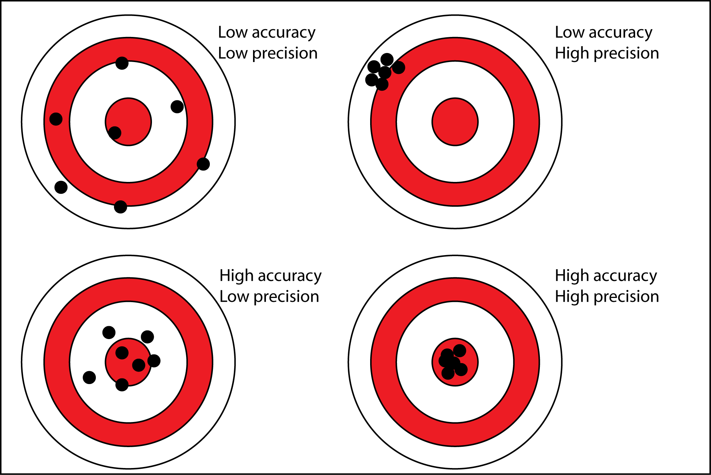
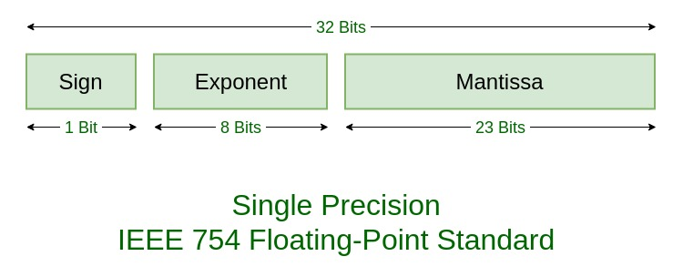

***Understanding and Using Floating Point Numbers***

Floating numbers are weird. Given enough bits, you can always represent a integer in binary. Yet, for floating numbers, that is not the case. 

 *Accuracy vs Precision*\
    Accuracy is how close you are to the target, precision is how much information you have about a quantity\
\
**Integers** have full accuracy. If I have a integer "2", it is exactly on the dot, not much, not less than the real mathematical *2*. However, integers lack precision. *5/2* and *4/2* give us both *2*.\
**Floats** are the opposite. They can be really precise, since they don't deliberately discard information to represent your number, but they are really poor when it comes to accuracy since not every fraction can be represented exactly in binary, no finite decimal digit representation (e.g. *0.333333*) can ever be equal to *1/3*.

***Floating point number representation***
The standard for floating point number representation is IEEE 754. Every float-point representation has a *mantissa* and an *exponent*. For example, the number 0.0045 in scientific notation will be represented as 4.5 \* 10-3. The -3 is the *exponent* and the *mantissa* 4.5. The *mantissa* has to be a number between 1 and 9.99. In binary, we can do much the same thing. The *mantissa* will take values from 1 to 1.99. The exponent can also be represented in binary as some integer. To interpret the number we take the *mantissa* and multiply it by two raised by the exponent. So, 0.0045 is equal to 1.00100110111010010111100 × 201110111.

*IEEE 754*
Per convention, IEEE 754 doubles are made up of 32 bits. The first bit is the *sign* bit. 0 for positive, 1 for negative. The next 8 bits are for the *exponent*. Since we want to be able to represent negatives exponents, and 8 bits can represent 254 numbers, we shift left the range until we are in the middle - 127. Basically it means you have to subtract 127 to the *exponent* value to get the real exponent. The remaining 23 bits are for the mantissa. Since the number will always be 1.XXX, we don't need to represent the first number.\

***RESOURCES***\
URLs:
- 
- [Jeff Bezanson for Cprogramming - Understanding and Using Floating Point Numbers](https://www.cprogramming.com/tutorial/floating_point/understanding_floating_point.html)
- [Spanning Tree -  How Floating-Point Numbers Are Represented ](https://www.youtube.com/watch?v=bbkcEiUjehk)

